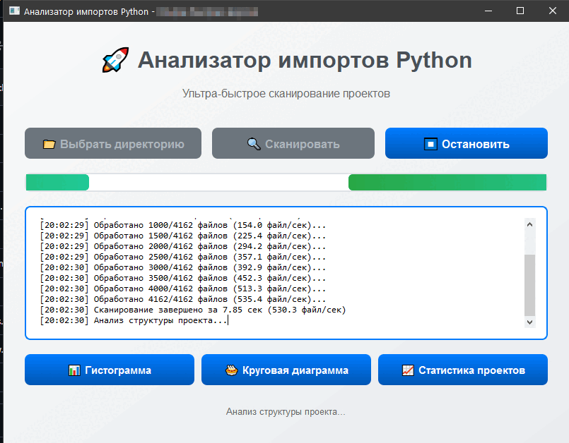

[](https://www.python.org/downloads/)
[](https://pypi.org/project/PySide6/)
[](https://matplotlib.org/stable/)
[](https://opensource.org/licenses/MIT)
[]()

# py-import-scanner

## Description

**py-import-scanner** is a tool designed to scan Python scripts for imported libraries. It allows you to analyze your code and identify all the imported libraries while excluding standard libraries like `os`, `sys`, and others.

The program provides functionality for visualizing the data in the form of histograms and pie charts, showing the count of different imported libraries and their usage in the project. This allows developers to see which libraries they actively use and improve dependency management.

**Program provides**:


## Operating principle


## Features

- Scans Python scripts in the specified directory.
- Excludes standard libraries and packages listed in `.gitignore`.
- Generates statistics on imports.
- Displays histograms and pie charts using `matplotlib`.
- Option to copy statistics to the clipboard.
-  **Multi-language support**: English and Russian interface localization.

## Installation

1. **Clone the repository:**

   In the command line or PowerShell, run:

   ```bash
   git clone https://github.com/AlgorithmAlchemy/py-import-scanner.git
   cd py-import-scanner
   ```

2. **Install dependencies:**

   Make sure you have Python 3.7 or higher, and then install all the dependencies:

   ```bash
   pip install -r requirements.txt
   ```

## Usage

**Run the program:**

   To run the program, simply execute the file:

   ```bash
   python main.py
   ```

   This will open the graphical interface where you can select a directory to scan. Choose a directory, and the program will begin processing the files.

**Graphical Interface:**

   The program uses the `PySide6` library for the modern graphical interface. You will be able to see:
   - Buttons to select the folder
   - Statistics on the imports
   - A histogram and pie chart displaying the frequency of library usage
   -  Language selection option for interface localization

**Interface Features:**

   - The **"Select Folder"** button allows you to choose the folder for scanning
   - The **"Histogram"** and **"Pie Chart"** buttons display the statistics visualization
   - The statistics can be copied to the clipboard for further use
   - Language switcher for English and Russian interface

## Project Structure

- **main.py** — main script to run the program
- **gui/** — directory containing GUI components
  - **main_window.py** — main window interface
  - **stats_window.py** — statistics window
  - **chart_windows.py** — chart visualization windows
- **utils.py** — utility functions
- **requirements.txt** — dependencies file for the project
- **README.md** — Russian documentation
- **README_en.md** — English documentation
- **data/** — directory for resources (icons, images, etc.)

## Notes

- This project uses libraries for visualization, such as `matplotlib` and `pyperclip`
- The GUI is built with PySide6 for modern cross-platform compatibility
- If you encounter errors or issues with dependencies, you can install them manually using:

  ```bash
  pip install matplotlib pyperclip colorama PySide6
  ```

## License

This project is licensed under the MIT License. For more details, see the `LICENSE` file.
